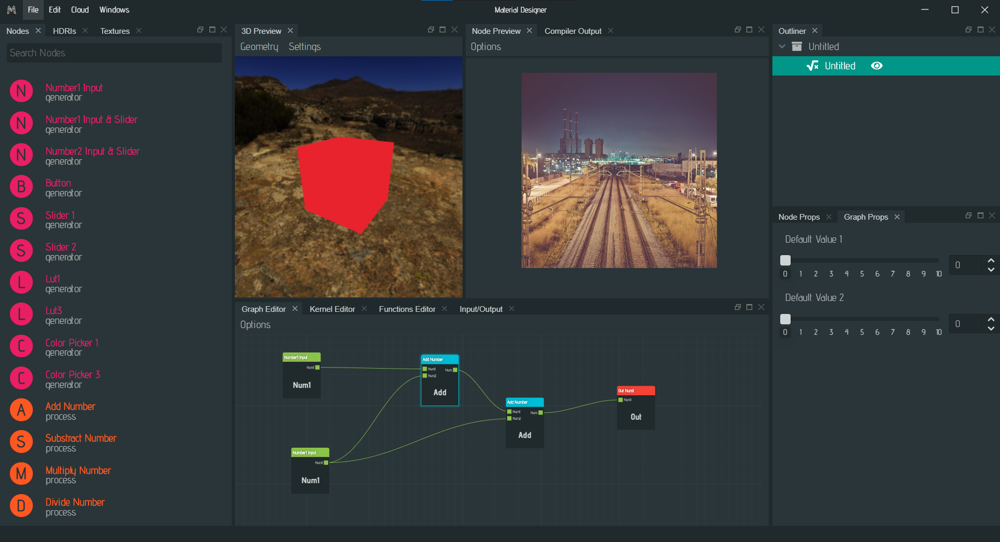
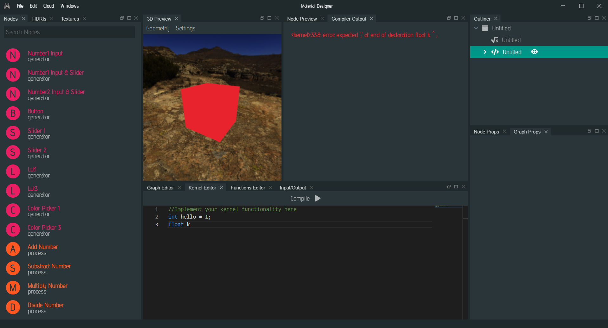
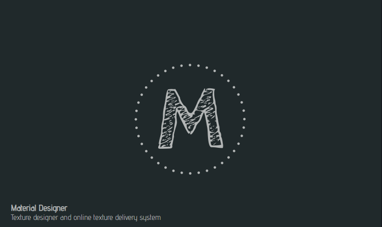
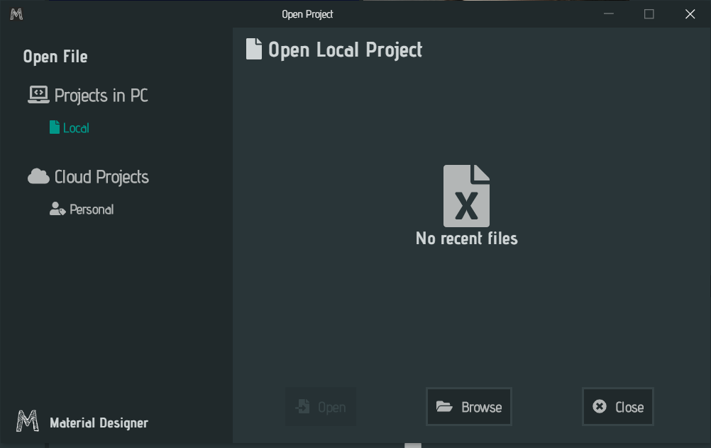
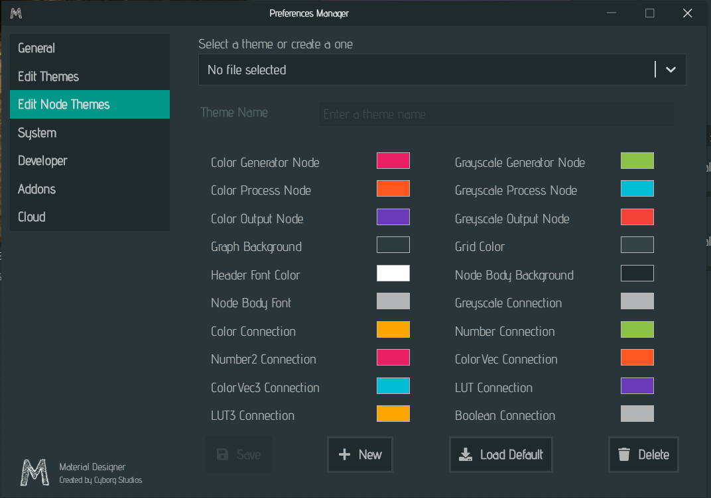
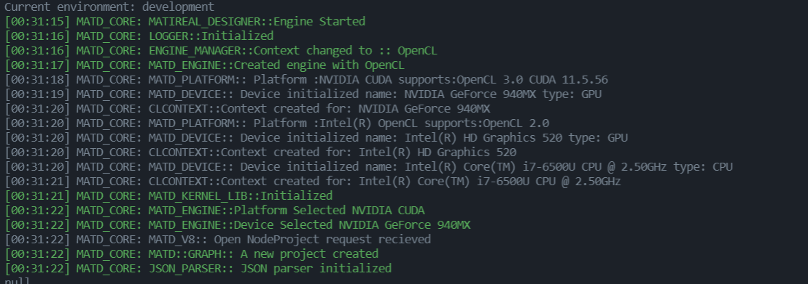

# Material Designer App

This is the material designer app repository, here you can use this to create procedural textures and under the hood this project uses the material designer library, which is available from [here](https://github.com/lazzy07/material_designer_library).

## How Material Designer work?

Material Desigener is a node based texture designer software which is free to use. Material Designer app is the gui to the project Material Designer library. Material library was written using C++ and CMake, which is bound to NodeJS Electron application using N-API.

### N-API Bindings for Material Designer App

You can find the documentation for N-API bindings [here](https://github.com/lazzy07/material_designer_library/tree/main/matd_v8). This library can be port to NodeJS or an Electron app as native module.

## Current Progress (UI)

Here are some screenshots of the current progress as of (2022/03/17)

### Main screen when working on a data graph

Datagraphs are the data that being passed to the kernels when they calculate pixel data. This window layout can be used to create these Datagraphs.

### Main screen when working on a kernel graph

Core of the engine is made out of OpenCL and CUDA (CUDA not implemented yet) you can use this window layout to create kernels for OpenCL/CUDA.

### Loading Screen

Loading sceen will be shown to the users while program being load into the memory.

### Open Project Screen

Opening projects which you created earlier can be accessed using this screen. Material designer will keep track on the latest files you created/opened using material designer. Currently cloud features are not available.

### Preferences Screen

Preferences screen can be used to customize how material designer look and feel. Also it will allow you to tweak and configure the editor the way you want it.

### Console Outputs

This screen is only available for the users who have turned debugging on. (Advanced Users)

