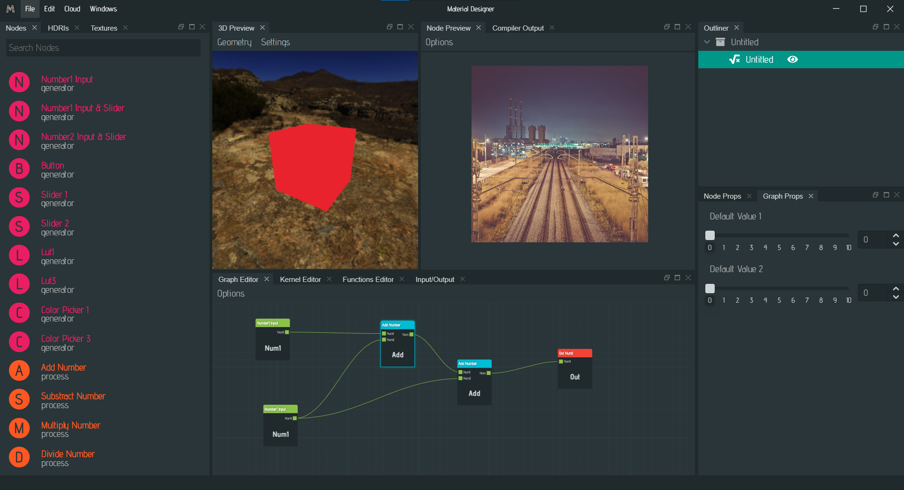
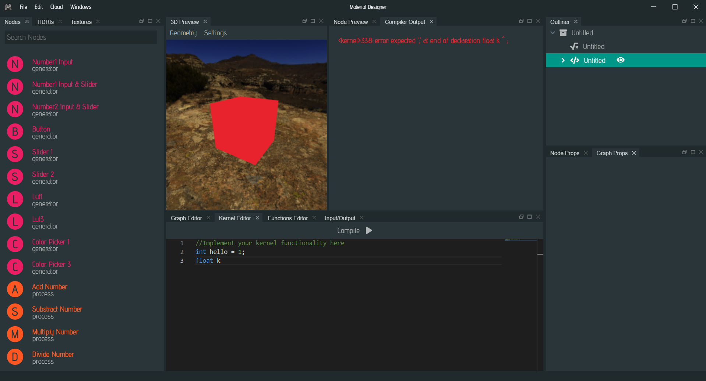
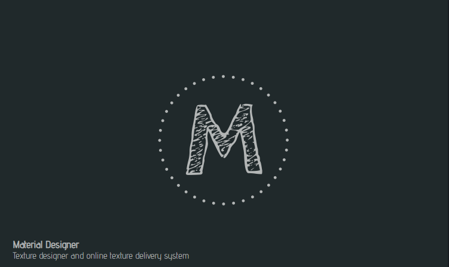
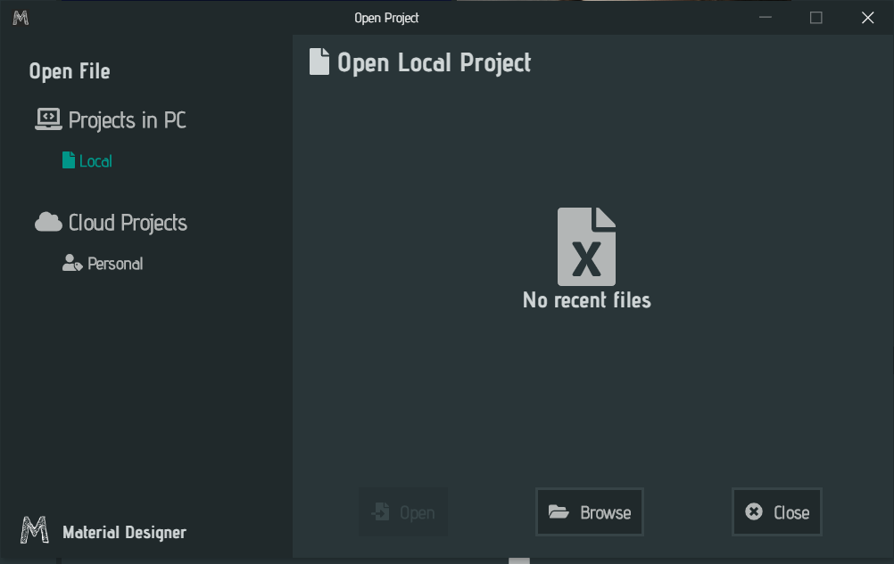
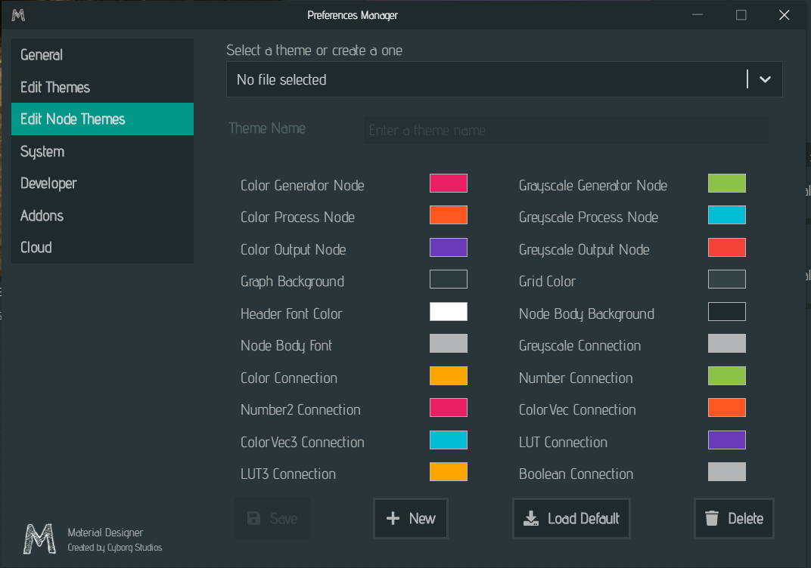

# Material Designer App

This is the material designer app repository, here you can use this to create procedural textures and under the hood this project uses the material designer library, which is available from [here](https://github.com/lazzy07/material_designer_library).

## How Material Designer work?

Material Desigener is a node based texture designer software which is free to use. Material Designer app is the gui to the project Material Designer library. Material library was written using C++ and CMake, which is bound to NodeJS Electron application using N-API.

### N-API Bindings for Material Designer App

You can find the documentation for N-API bindings [here](https://github.com/lazzy07/material_designer_library/tree/main/matd_v8). This library can be port to NodeJS or an Electron app as native module.

## Current Progress (UI)

Here are some screenshots of the current progress as of (2022/03/17)

### Main screen when working on a data graph

### Main screen when working on a kernel graph

### Loading Screen

### Open Project Screen

### Preferences Screen

### Console Outputs

This screen is only available for the users who have turned debugging on

